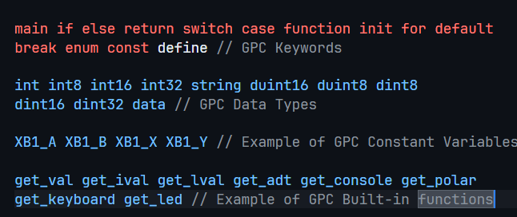
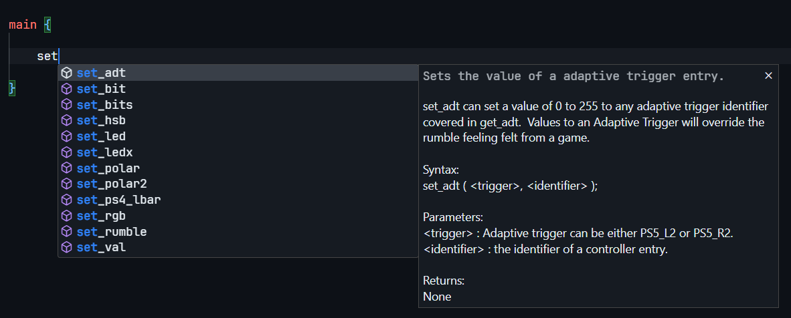
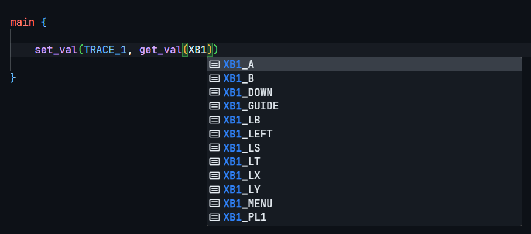
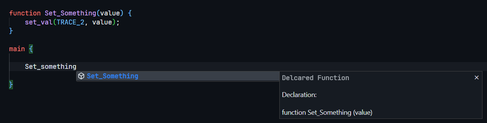

# About

This extension adds GPC Scripting support to VSCode.

GPC is a programming language developed and maintained by Collective Minds, made for the Cronus Zen Device.

## Features
* Intellisense Features
* Auto-Completion
* Syntax Highlighting
* Intellisense will not show 2D or 1D arrays if they do not contain a ';' 

## Examples

### Syntax Highlighting
#### Highlighting is dependent on the theme you use.

### Language Functions
#### Intellisense is able to recognize the built-in functions GPC has, and provides details about each one from: https://guide.cronus.support/gpc

### Language Constants
#### Intellisense is able to recognized all type constants that GPC has. This example shows buttons for the Xbox One Controller.

### User Defined Functions
#### The intellisense is able to recognize all User-Defined Functions. Showing how they're defined and the parameters associated with it.

# Disclaimer

Any trademarks related to this repository are owned by their respective owners.